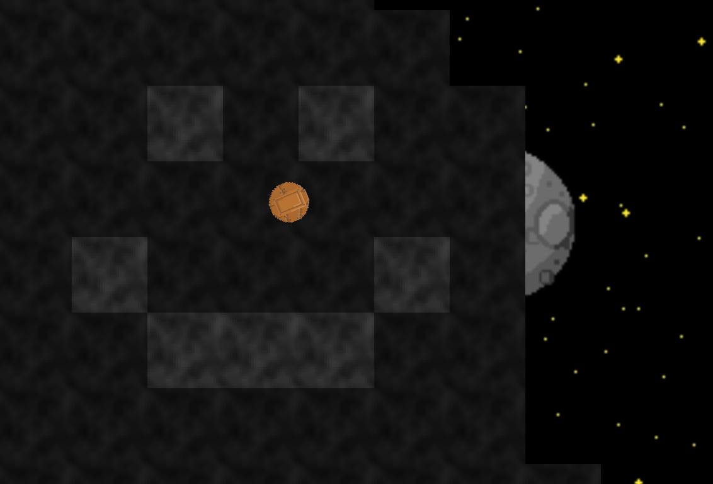
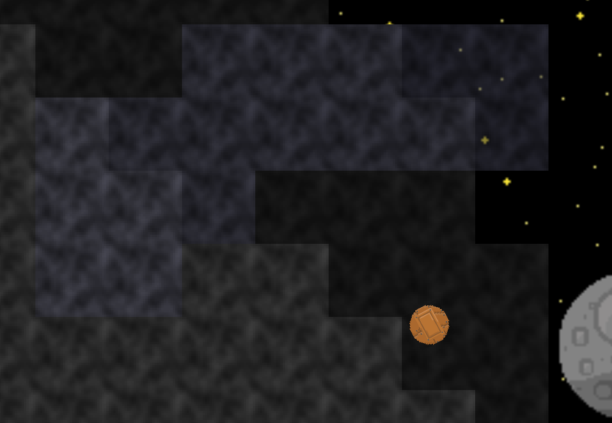
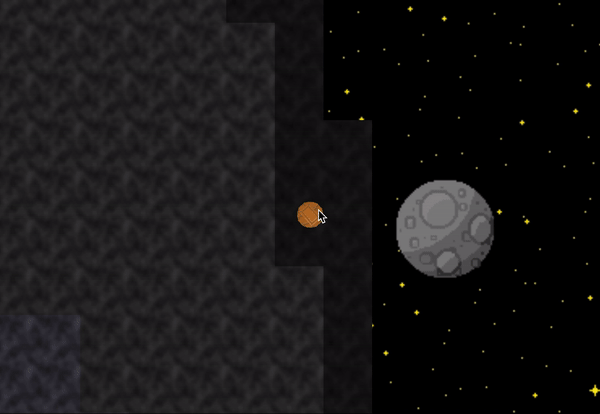
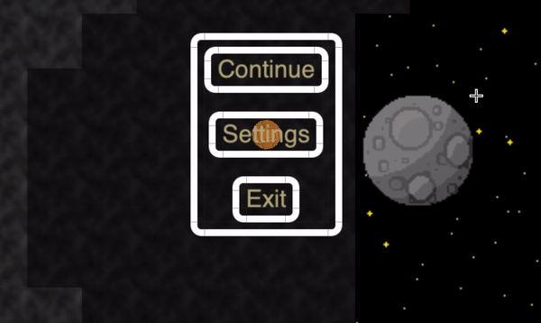

# Alithed

This project is mainly a way for me to get back into python, as well as to learn pyglet. If there ever comes a fully functioning game out of it, that is just a biproduct.

Feedback is very much appreciated! I'm in no way a professional programmer, and as I said, I do this for the learning experience.

Here is the project's [Trello Board](https://trello.com/invite/b/JwDc3zBP/10e69bb7f3abc281623fd9ba24631cfc/pyglet-survival-game) with planned features.

Textures and images mostly by my friend TTBob.

## Features

### Terrain

The game currently features fully editable terrain, including placing and removing tiles.

Working on making removing terrain more like mining, meaning it will take time, and you will get an item (stone or ore) when the tile is removed.

The terrain is rendered in layers, which makes it possible to show many z-levels at once, even though the game is top-down. Tiles with a high z-level are rendered lighter, and partly transparent, and tiles at the "bottom" are rendered darker.

This setup can be a bit tricky to get into, but as soon as you get used to it, it gives a clear view of how the world looks.

The terrain is randomly generated using perlin noise, and is also stored in memory, meaning your progress is saved when you decide to exit the game.

### Player Movement

The game features rich character movement, including collision detection, 8-way movement, and moving between z-levels by simply walking up a ledge.

### Gui

The gui is far from done, but the basic framework is there. I use glooey (a Gui-library built on top of pyglet) to handle ui.

The menus you see in this video are just placeholders while I'm working on some nicer textures.

### Items & Inventory

Currenly in the workings is also a inventory system, which includes items.

All the ores and materials in the game will be randomly generated, which will give you a unique experience every time. The items won't have fixed names. You will have to name everything you find yourself, making your world feel personal.
